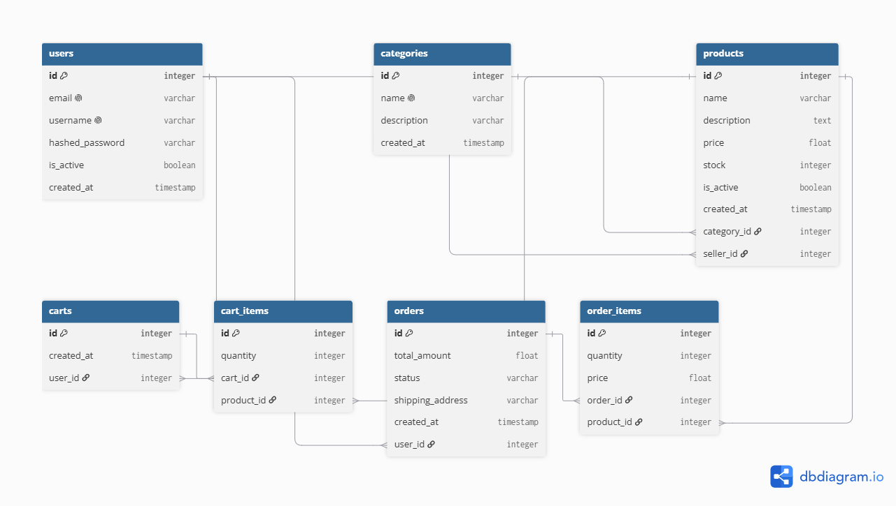
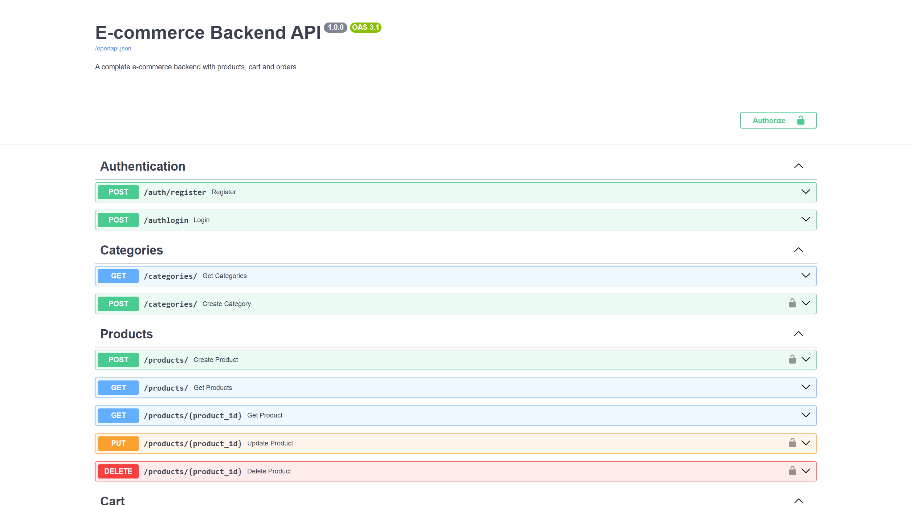
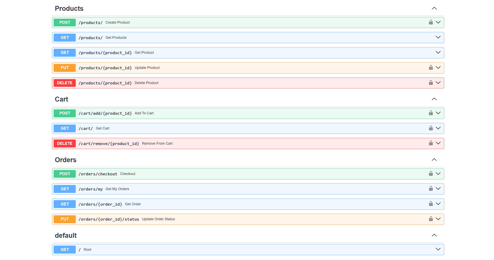
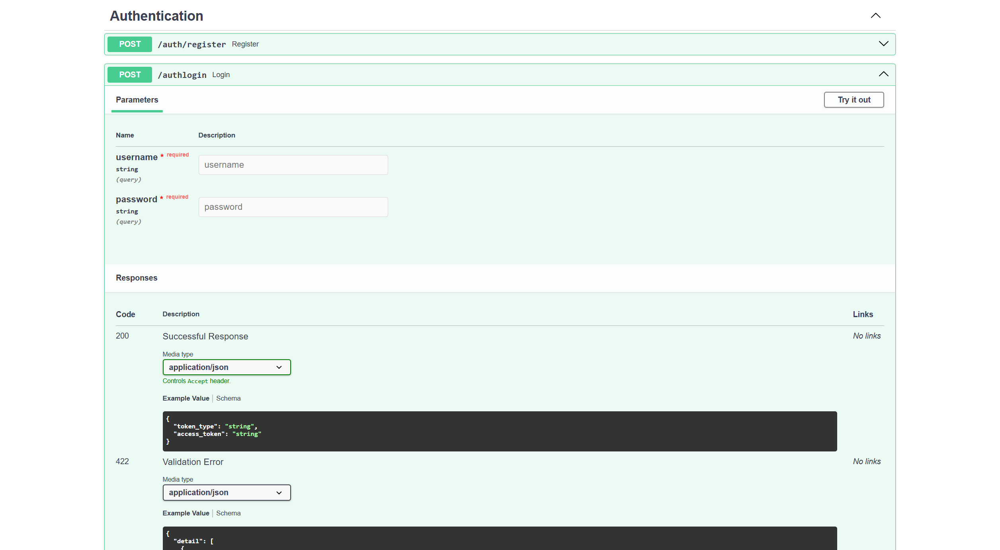
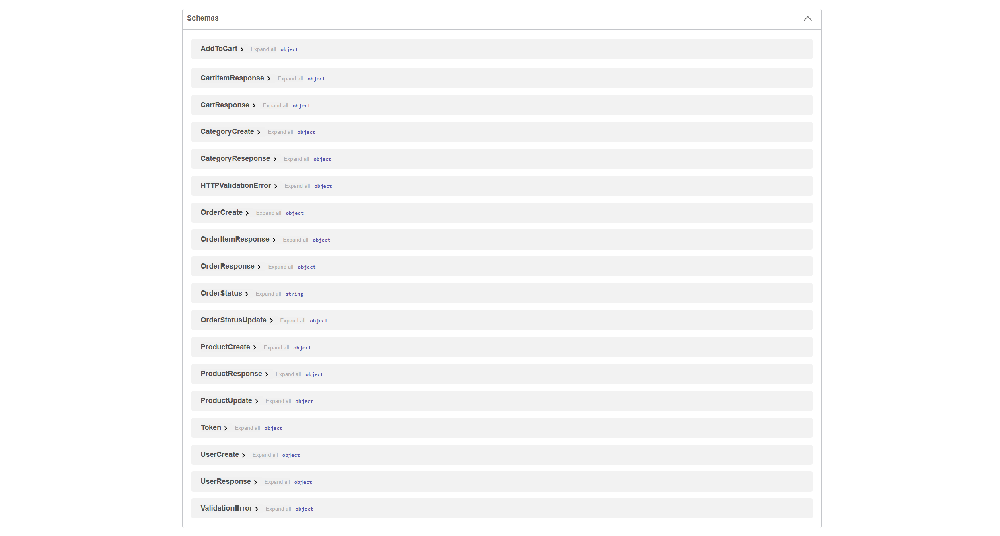

# 🛒 E-commerce Backend API

A complete e-commerce backend API with products, cart management and order processing built with FastAPI and PostgreSQL.

---

## 🚀 What This Project Does

- Register and login securely
- Browse products publicly without login
- Search and filter products by keyword and category
- Add products to cart with quantity management
- Checkout cart to create orders automatically
- Track order status (pending/confirmed/shipped/delivered)
- Sellers can manage their own products
- Stock automatically reduces on order placement

---

## 🧠 What I Learned Building This

- Cart system with automatic cart creation per user
- Order placement converting cart items to order items
- Stock management on checkout
- Multiple related models (Cart, CartItem, Order, OrderItem)
- Public vs protected endpoints
- Complex checkout logic with validation

---

## 🛠️ Tech Stack

| Technology | Purpose |
|------------|---------|
| Python 3.14 | Programming language |
| FastAPI | Web framework |
| PostgreSQL | Database |
| SQLAlchemy | ORM |
| Alembic | Migrations |
| PyJWT | Authentication |
| bcrypt | Password hashing |
| Docker | Containerization |
| Uvicorn | Server |

---

## ⚙️ How To Run

### Without Docker:
```bash
git clone https://github.com/sivamani151dev-cell/ecommerce-backend.git
cd ecommerce-backend
python -m venv venv
venv\Scripts\activate
pip install -r requirements.txt
python -m alembic upgrade head
uvicorn app.main:app --reload
```

### With Docker:
```bash
docker-compose up --build
```

---

## 📡 API Endpoints

### Authentication
| Method | Endpoint | Description | Auth |
|--------|----------|-------------|------|
| POST | `/auth/register` | Register | ❌ |
| POST | `/auth/login` | Login | ❌ |

### Categories
| Method | Endpoint | Description | Auth |
|--------|----------|-------------|------|
| POST | `/categories/` | Create category | ✅ |
| GET | `/categories/` | Get all categories | ❌ |

### Products
| Method | Endpoint | Description | Auth |
|--------|----------|-------------|------|
| POST | `/products/` | Add product | ✅ |
| GET | `/products/` | Browse products | ❌ |
| GET | `/products/?keyword=x` | Search products | ❌ |
| GET | `/products/{id}` | Get product | ❌ |
| PUT | `/products/{id}` | Update product | ✅ |
| DELETE | `/products/{id}` | Delete product | ✅ |

### Cart
| Method | Endpoint | Description | Auth |
|--------|----------|-------------|------|
| POST | `/cart/add/{product_id}` | Add to cart | ✅ |
| GET | `/cart/` | View cart | ✅ |
| DELETE | `/cart/remove/{product_id}` | Remove from cart | ✅ |

### Orders
| Method | Endpoint | Description | Auth |
|--------|----------|-------------|------|
| POST | `/orders/checkout` | Place order | ✅ |
| GET | `/orders/my` | My orders | ✅ |
| GET | `/orders/{id}` | Get order | ✅ |
| PUT | `/orders/{id}/status` | Update status | ✅ |

---

## 🔐 Environment Variables

| Variable | Description |
|----------|-------------|
| `DATABASE_URL` | PostgreSQL connection string |
| `SECRET_KEY` | JWT secret key |
| `ALGORITHM` | JWT algorithm |
| `ACCESS_TOKEN_EXPIRE_MINUTES` | Token expiry |

---

## 📁 Project Structure

ecommerce-backend/
├── app/
│ ├── main.py
│ ├── database.py
│ ├── auth.py
│ ├── models/
│ │ ├── user.py
│ │ ├── category.py
│ │ ├── product.py
│ │ ├── cart.py
│ │ └── order.py
│ ├── schemas/
│ │ ├── user.py
│ │ ├── category.py
│ │ ├── product.py
│ │ ├── cart.py
│ │ └── order.py
│ └── routers/
│ ├── auth.py
│ ├── categories.py
│ ├── products.py
│ ├── cart.py
│ └── orders.py
├── alembic/
├── docs/
│ ├── er_diagram.png
│ └── swagger_overview.png
├── Dockerfile
├── docker-compose.yml
├── .env.example
├── requirements.txt
└── README.md
---

## 📊 Database Schema



---

## 📸 Screenshots







## Live Deployment 

Coming soon!..

---

## 🎯 Project Type
Portfolio Project — built to demonstrate real-world e-commerce capabilities with cart and order management.